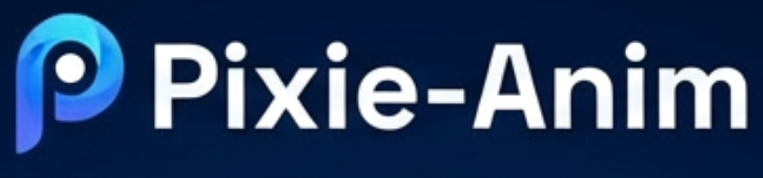
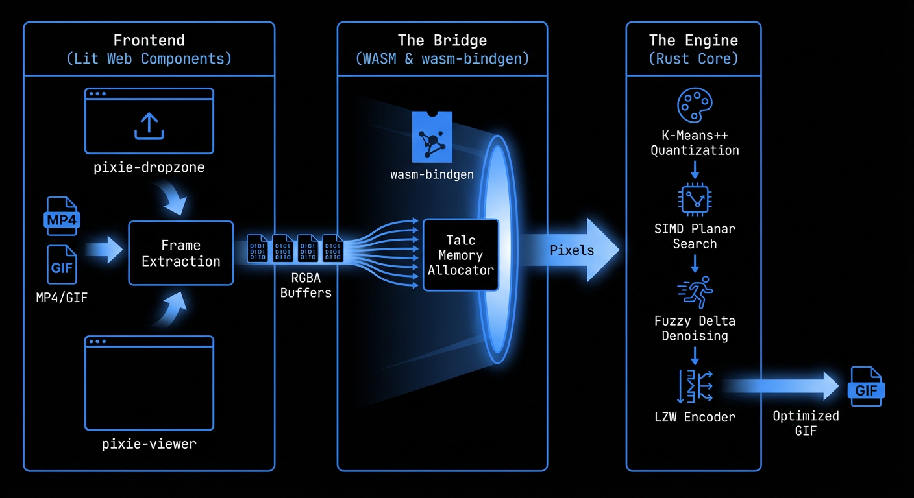

# Pixie-Anim

<p align="center">
  
</p>



A high-performance, zero-dependency short-form animation optimizer written in Rust and WebAssembly.

Inspired by Lee Robinson's [pixo](https://github.com/leerob/pixo), Pixie-Anim follows a similar philosophy: building mission-critical codecs from scratch without heavy runtime dependencies, optimized for both native CLI performance and zero-latency in-browser execution.


## 🚀 Key Features

- **Zero-Dependency Core**: From-scratch implementation of GIF89a and LZW.
- **Superior Compression**: Achieves **20-30% smaller** files than Gifsicle -O3 through advanced heuristics.
- **Perceptual Quantization**: Uses CIELAB color space and K-Means++ for superior color fidelity.
- **Fuzzy Delta Compression**: Temporal denoising that treats "nearly identical" pixels as transparent, dramatically reducing size for real-world video.
- **Parallelized & SIMD**: Multi-threaded quantization via Rayon and Planar AVX2 kernels for nearest-color search.
- **WASM Playground**: Fully functional, client-side optimizer with direct MP4-to-GIF support.
- **Subjective LLM Judge**: Automated quality evaluation via Gemini 3 Flash.

## 📊 Performance Matrix (720p HD)

| Tool | Mode | Speed (per frame) | Size (KB) | Subjective (1-10) |
| :--- | :--- | :--- | :--- | :--- |
| **Gifsicle -O3** | Standard | ~123ms | 76,312 | - |
| **FFmpeg** | 2-Pass HQ | ~270ms | 78,340 | - |
| **Pixie-Anim** | **Quality/Lossy**| **~110ms** | **66,620** | **7** |

*Benchmarked on an 8-second high-motion drone sequence. Pixie-Anim provides a significant size advantage while maintaining competitive speed.*

## 🧠 Algorithms

### Zeng Palette Reordering
By ordering the 256-color palette by visual similarity, we maximize the length of LZW strings, gaining "free" compression with negligible compute cost.

### Lossy LZW (Fuzzy Neighbor Matching)
A unique optimization where the encoder can match visually similar "neighbor" indices in the Zeng-ordered palette to continue an LZW sequence, further collapsing file size.

### Planar SIMD Search
We discovered that standard interleaved RGB SIMD is often slower than scalar for small palettes. Pixie-Anim uses a **Planar** data layout to unlock the true potential of AVX2/NEON for nearest-color search.

## 🛠 Usage

### CLI
Build the native binary:
```bash
cargo build --release --features="cli"
```
The binary will be available at `target/release/pixie-anim`.

Optimize an image sequence:
```bash
./target/release/pixie-anim frames/*.png --output optimized.gif --fps 15 --lossy 8 --fuzz 10
```

### Web Playground
The web UI is a Lit-based application that leverages the Rust core via WASM.
1. `cd web`
2. `pnpm install`
3. `pnpm run dev` (This automatically triggers `build-wasm` to generate bindings)
4. Drop an MP4 or GIF into the browser to optimize locally.

*Note: To prevent browser memory exhaustion, the web playground currently scales video to 640px and caps extraction at 300 frames. Use the CLI for unlimited high-resolution processing.*


## 👁️ Automated Evaluation
Pixie-Anim includes a `judge` tool that uses **Gemini 3 Flash** to perform a comparative analysis of the output, identifying artifacts like banding or temporal jitter that traditional metrics (PSNR/SSIM) might miss.

## 📖 Resources
- **Deep Dive**: [Optimizing GIFs with Pixo: Extending Lessons Learned](https://ghc.wtf/writing/optimizing-gifs-with-pixo-extending-lessons-learned/) - A technical writeup on the architecture and philosophy behind Pixie-Anim.

---
Part of the **Pixie** family of high-performance media tools

## 📋 Prerequisites

### Core Development
- **Rust** (1.70+)
- **Node.js & npm/pnpm** (For Web Playground)
- **wasm-bindgen-cli** (`cargo install wasm-bindgen-cli`)

### Benchmarking & Evaluation
To run the comparative benchmarks and the subjective judge, you'll need:
- **FFmpeg**: For frame extraction and judge frame analysis.
- **Gifsicle**: For baseline compression comparison.
- **gifski**: For high-quality comparison.
- **bc**: For benchmark timing calculations.
- **Gemini API Key**: Set as `GEMINI_API_KEY` in your environment or `.env` file for the `judge` tool.

Install on macOS via Homebrew:
```bash
brew install ffmpeg gifsicle gifski bc
```
