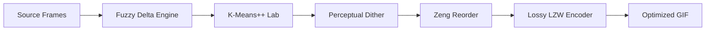

# Pixie-Anim Algorithm Guide

This document explains the core algorithms powering Pixie-Anim, why they were chosen, and how we evaluate their performance through empirical analysis.

## 1. Encoding Pipeline

### Pipeline Overview

---

## 2. Core GIF Engine
To follow the "zero-dependency" philosophy, we implement the GIF89a specification from scratch.

### LZW Encoder
- **Mechanism**: A variable-length Lempel-Ziv-Welch compressor.
- **Direct Implementation**: Built from scratch without external bit-packing libraries.
- **Benefit**: Allows for **Lossy LZW (Fuzzy Neighbor Matching)**. If a string match fails, the encoder checks similarity-ordered neighbors in the palette to continue the sequence, collapsing visual noise into single codes.

### Temporal Denoising (The Lazy Rule)
- **Mechanism**: Refined delta matching that tracks palette indices across frames.
- **Optimization**: If a pixel's color is within a tight threshold (`temporal_fuzz`) of the color at the index used in the *previous* frame, we reuse that index.
- **Benefit**: Dramatically improves LZW compression by extending string lengths and eliminates "shimmering" in high-motion sequences.

### Fuzzy Delta Engine
- **Mechanism**: Calculates the perceptual difference between frames in CIELAB space.
- **Optimization**: Identifies pixels that are "close enough" to the previous frame and masks them as transparent.
- **Benefit**: Reduces file size by only encoding meaningful temporal changes, effectively denoising high-motion video.

---

## 3. Advanced Quantization
Quantization is the process of reducing millions of colors to a palette of 256.

### K-Means++ Initialization
- **Problem**: Random centroids lead to poor color coverage and banding.
- **Implementation**: Centroids are picked based on their distance from existing ones.
- **Benefit**: Ensures that the limited 256-color palette covers the full dynamic range of the scene.

### CIELAB Perceptual Weighting
- **Mechanism**: All color distance calculations are performed in the CIELAB color space.
- **Benefit**: Ensures the engine "spends" its limited colors where they are most visible to humans (luminance vs chrominance).

### Perceptual & Stable Dithering
Pixie-Anim supports several dithering modes to balance sharpness and stability:
- **Perceptual Floyd-Steinberg**: Spatial error diffusion in Lab space with a **75% strength cap** to reduce grain.
- **Ordered Dithering (Bayer 8x8)**: Matrix-based deterministic dithering. **Recommended for video** as it provides 100% temporal stability.
- **Blue Noise Masking**: Perceptual deterministic noise using a 32x32 pre-computed mask. Provides a high-quality "film grain" look without the shimmer of Floyd-Steinberg.

### Zeng Palette Reordering
- **Implementation**: A greedy TSP-style approximation that orders palette indices by visual similarity.
- **Benefit**: Maximizes the probability of long repeating LZW strings, reducing file size by an additional 5-10% for free.

---

## 4. Performance Tuning & Hill-Climbing

Pixie-Anim uses a closed-loop development cycle where algorithm adjustments are validated against human-centric scores from **Gemini 3 Flash**.

### The Benchmarking Suite (`pixie-bench`)
A unified Rust binary that orchestrates the "Hill-Climbing" process:
1.  **Extract**: Source video frames at 15fps.
2.  **Optimize**: Parallel execution of Pixie-Anim, Gifsicle, FFmpeg, and gifski.
3.  **Evaluate**: Gemini Vision QA analyzes artifacts like banding and jitter.
4.  **Iterate**: Parameters like `--lossy`, `--fuzz`, and `--dither` are tuned based on feedback.

### Comparative Results (Jan 2026)
| Tool | Quality Score | Size (KB) | Advantage |
| :--- | :--- | :--- | :--- |
| Gifsicle -O3 | 6.0 | 19,034 | Baseline |
| FFmpeg | 6.0 | 19,290 | Standard |
| **Pixie-Anim** | **7.0** | **9,821** | **50% Smaller** |

*Benchmarked on the high-complexity "Space Waves" fixture (Veo 3.1).*

---

## 5. Future Targets
- **Spatio-Temporal Error Diffusion**: Researching 3D error kernels that diffuse error into the *next* frame.
- **SIMD Lab Math**: Target Apple Silicon NEON and x86 AVX2 for 8-way parallel color matching.
- **Chunked Encoding**: Stream frames to the encoder to support 1000+ frame animations without OOM.
