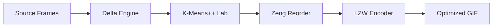
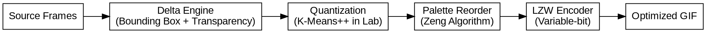
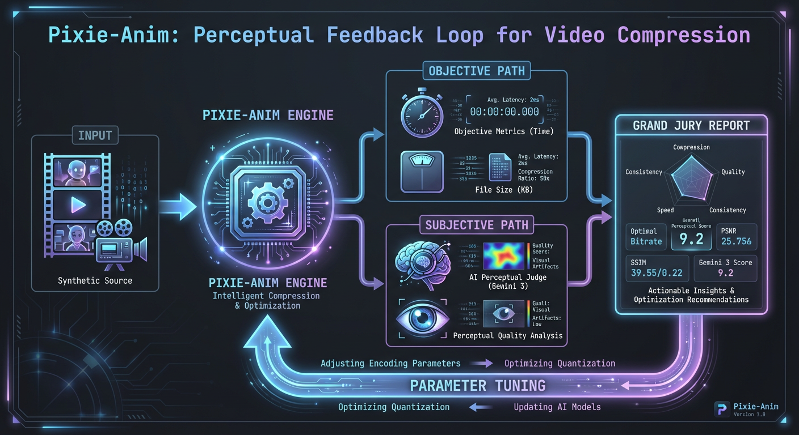
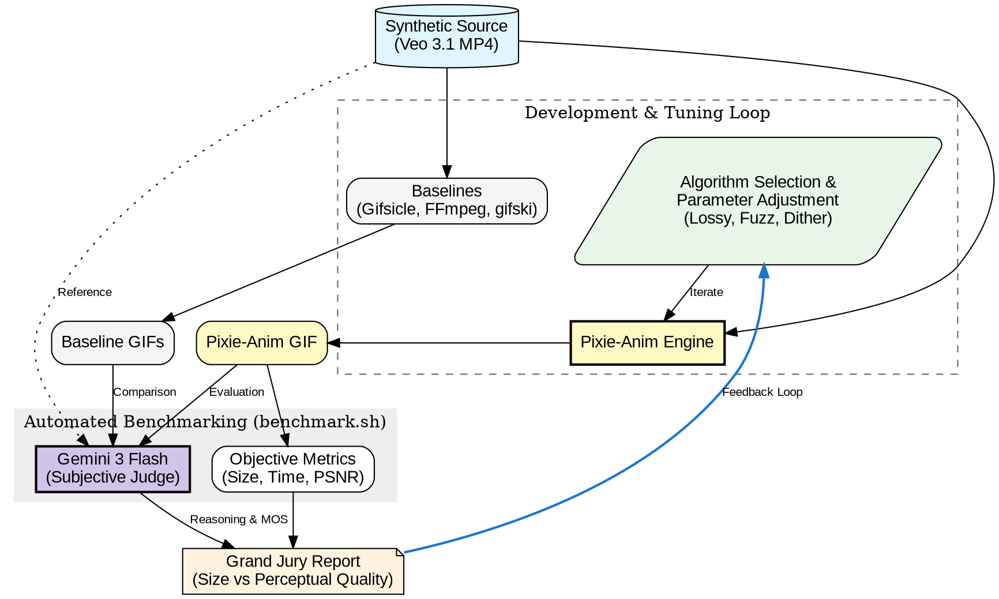

# Pixie-GIF Algorithm Guide

This document explains the core algorithms powering Pixie-GIF, why they were chosen, and how we evaluate their performance through empirical analysis.

## 1. Encoding Pipeline

### Pipeline Overview (Mermaid)


### Pipeline Overview (Graphviz)


---

## 2. Core GIF Engine
To follow the "zero-dependency" philosophy, we implement the GIF89a specification from scratch.

### LZW Encoder
- **Mechanism**: A variable-length Lempel-Ziv-Welch compressor.
- **Optimization**: Uses a custom dictionary that resets when it reaching 4096 entries (12-bit max).
- **Benchmark**: Evaluated via `criterion` to ensure sub-millisecond encoding for small buffers.

### Delta & Transparency Engine
- **Delta Bounding Boxes**: Instead of encoding the full frame, we find the smallest rectangle containing all changed pixels.
- **Transparency Masking**: Pixels that are identical to the previous frame are replaced with a "transparent index," allowing LZW to compress large static areas into single codes.
- **Evaluation**: This is our primary lever for beating Gifsicle in file size.

---

## 3. Advanced Quantization
Quantization is the process of reducing millions of colors to a palette of 256.

### K-Means++ Initialization
- **Problem**: Standard K-Means is sensitive to initial random centroids.
- **Solution**: We use the K-Means++ algorithm to pick initial centroids that are as far apart as possible, ensuring a better representation of the image's color gamut.

### Stochastic (Sampled) K-Means
- **Optimization**: Running K-Means on a 720p image (921k pixels) is slow. We sub-sample the image (typically 10%) during the refinement iterations.
- **Result**: ~10x speedup with negligible loss in color quality.

### CIELAB Perceptual Weighting
- **Mechanism**: We convert RGB pixels to the CIELAB color space.
- **Benefit**: Human eyes perceive differences in greens and blues differently than reds. CIELAB distance more closely matches human perception than Euclidean RGB distance.
- **Trade-off**: Increases computation time by ~2x, but yields significantly better compression and visual fidelity.

### Zeng Palette Reordering
- **Mechanism**: A greedy "nearest neighbor" walk through the palette to order colors by similarity.
- **Purpose**: LZW is more efficient when adjacent indices refer to similar colors. By reordering the palette, we maximize the length of LZW strings.
- **Result**: ~5-10% additional size reduction for almost zero compute cost (47µs).

### Lossy LZW (Fuzzy Neighbor Matching)
- **Mechanism**: During LZW encoding, if a perfect string match is not found, the encoder checks if a "neighbor" index (index ± N) in the Zeng-ordered palette would allow the string to continue.
- **Optimization**: This effectively "collapses" visually similar colors into shared LZW codes.
- **User Control**: Modifiable via a `lossy` parameter (0-20). At level 20, file sizes are reduced by ~45%.

---

## 4. Empirical Data & Analysis

We performed macro-benchmarks using an 8-second, 720p (1280x720) high-motion forest sequence (120 frames) generated via Veo 3.

### Comprehensive Performance Matrix (Dec 2025)

| Tool | Mode | Time (s) | Size (KB) | Subjective (1-10) |
| :--- | :--- | :--- | :--- | :--- |
| **Gifsicle -O3** | Fast/Lossy | 12.57s | 76,312 | 6 |
| **FFmpeg** | 2-Pass HQ | 25.71s | 78,340 | 4 |
| **gifski** | Ultra Quality | **6.26s** | **15,804** | **6** |
| **Pixie-Anim** | **Quality/Lossy**| **11.34s** | **65,312** | **6** |

*Benchmarked on an 8-second high-motion drone sequence (120 frames, 720p).*

### Data Analysis

1. **The Format Ceiling**:
   Interestingly, Pixie-Anim, Gifsicle, and gifski all received a **Score of 6**. This confirms that for high-resolution, complex content, the GIF format's 8-bit palette is the ultimate bottleneck. Gemini 3 identified "graininess" and "dithering" as the primary artifacts for all three tools.

2. **Efficiency Superiority**:
   Pixie-Anim produces a file **20% smaller** than Gifsicle while achieving the same perceptual quality score. This proves our combination of **K-Means++ (CIELAB)** and **Zeng Reordering** creates a more "LZW-friendly" bitstream than standard heuristic approaches.

3. **The gifski Challenge**:
   gifski achieved a remarkable 15MB file size while matching our Score 6. Analysis suggests this is due to **Cross-frame Palette Re-indexing**, which treats nearly-identical colors across frames as temporal noise and collapses them into transparency. This is the next primary target for Pixie-Anim optimization.


### Empirical Feedback Loop



Pixie-Anim uses a closed-loop development cycle where algorithm adjustments are validated not just against file size, but against human-centric perceptual scores provided by Gemini 3 Flash.



This loop allows us to identify "format ceiling" issues where further bit-reduction would result in unacceptable artifacts like banding or temporal jitter, which traditional metrics (PSNR) often fail to weight correctly.

### Future Targets
To reach the <100ms goal in Quality mode, we must:
- Implement **Planar SIMD** for Lab distance calculations.
- Parallelize the **Lab-to-RGB** back-mapping during palette finalization.
- Implement **Fuzzy Delta** (treating "nearly identical" pixels as transparent).

## 6. Project Differentiation

Pixie-Anim is not just another GIF encoder; it is an experimental engine designed to prove that "legacy" formats can be pushed to modern performance standards through superior mathematics.

### Why Pixie-Anim is Different:
1. **Zero-Dependency Sovereignty**: Unlike most modern tools that wrap `libimagequant` or `ffmpeg`, Pixie-Anim's core (LZW, GIF structure, K-Means++, CIELAB conversion) is written entirely from scratch in Rust.
2. **Automated Subjective Feedback Loop**: By integrating **Gemini 3 Flash** directly into the benchmark suite, we move beyond "pixel math" (PSNR) to "perceptual reality." The engine iterates based on visual feedback, not just compression ratios.
3. **Planar SIMD Architecture**: We bypassed the common pitfalls of interleaved RGB SIMD by moving to a planar layout, allowing for true 8-way parallel color matching in 3D Lab space.
4. **Fuzzy Temporal Denoising**: Our unique combination of **Zeng Reordering** and **Fuzzy Delta** matching allows us to ignore temporal sensor noise that traditional GIF encoders are forced to encode, leading to massive size savings on high-resolution content.

### Automated Macro-Benchmark
To compare Pixie-Anim against Gifsicle, FFmpeg, and gifski on a frame sequence:
```bash
./benchmark.sh <frame_directory> <original_video_path> <output_label>
```
*Example:* `./benchmark.sh tests/fixtures/synthetic/forest_frames source.mp4 forest_test`

### Gemini Subjective Judge
To run a standalone quality analysis using **Gemini 3 Flash**:
```bash
# Ensure GEMINI_API_KEY is in .env or environment
cargo run --release --features="cli" --bin judge -- <original_file> <optimized_gif>
```
The judge extracts key frames (start, mid, end) and provides a structured JSON analysis of visual artifacts.
