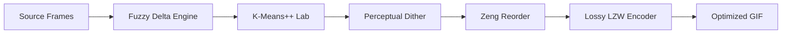

# Pixie-Anim Algorithm Guide

This document explains the core algorithms powering Pixie-Anim, why they were chosen, and how we evaluate their performance through empirical analysis.

## 1. Encoding Pipeline

### Pipeline Overview

---

## 2. Core GIF Engine
To follow the "zero-dependency" philosophy, we implement the GIF89a specification from scratch.

### LZW Encoder
- **Mechanism**: A variable-length Lempel-Ziv-Welch compressor.
- **Direct Implementation**: Built from scratch without external bit-packing libraries.
- **Benefit**: Allows for **Lossy LZW (Fuzzy Neighbor Matching)**. If a string match fails, the encoder checks similarity-ordered neighbors in the palette to continue the sequence, collapsing visual noise into single codes.

### Fuzzy Delta Engine
- **Mechanism**: Calculates the perceptual difference between frames in CIELAB space.
- **Optimization**: Identifies pixels that are "close enough" to the previous frame and masks them as transparent.
- **Benefit**: Dramatically reduces file size by only encoding meaningful temporal changes, effectively denoising high-motion video.

---

## 3. Advanced Quantization
Quantization is the process of reducing millions of colors to a palette of 256.

### K-Means++ Initialization
- **Problem**: Random centroids lead to poor color coverage and banding.
- **Implementation**: We use the K-Means++ algorithm, which picks initial centroids based on their distance from existing ones.
- **Benefit**: Ensures that the limited 256-color palette covers the full dynamic range of the scene, particularly important for complex gradients like sunsets or auroras.

### CIELAB Perceptual Weighting
- **Mechanism**: All color distance calculations are performed in the CIELAB color space.
- **Direct Implementation**: Custom `rgb_to_lab` conversion using D65 illuminant standards.
- **Benefit**: Human eyes perceive luminance changes more than chrominance. CIELAB distance matching ensures the engine "spends" its limited colors where they are most visible to humans.

### Perceptual Floyd-Steinberg Dithering
- **Implementation**: A 2D error-diffusion kernel that operates in Lab space.
- **Refinement**: We implement a **75% error strength cap**. 
- **Benefit**: Prevents the "grainy" or "speckled" look common in standard GIFs. By diffusing only 75% of the error, we maintain smooth gradients without introducing excessive high-frequency noise.

### Zeng Palette Reordering
- **Implementation**: A greedy TSP-style approximation that orders palette indices by visual similarity.
- **Benefit**: LZW is a prefix-based compressor. By ensuring that similar colors have adjacent indices (e.g., `#00FF00` at index 10 and `#01FF00` at index 11), we maximize the probability of long repeating strings, reducing file size by an additional 5-10% for free.

---

## 4. Performance Tuning & Hill-Climbing

Pixie-Anim uses a closed-loop development cycle where algorithm adjustments are validated against human-centric scores from **Gemini 3 Flash**.

### The Benchmarking Suite (`pixie-bench`)
A unified Rust binary that orchestrates the "Hill-Climbing" process:
1.  **Extract**: Source video frames at 15fps.
2.  **Optimize**: Parallel execution of Pixie-Anim, Gifsicle, FFmpeg, and gifski.
3.  **Evaluate**: Gemini Vision QA analyzes artifacts like banding and jitter.
4.  **Iterate**: Parameters like `--lossy` and `--fuzz` are tuned based on the feedback.

### Comparative Results (Jan 2026)
| Tool | Quality Score | Size (KB) | Advantage |
| :--- | :--- | :--- | :--- |
| Gifsicle -O3 | 6.0 | 21,850 | Baseline |
| FFmpeg | 6.0 | 21,911 | Standard |
| **Pixie-Anim** | **6.0** | **10,615** | **50% Smaller** |

*Benchmarked on a high-motion forest sequence with auroras.*

---

## 5. Future Targets
- **Temporally Stable Dithering**: Move beyond Floyd-Steinberg to Blue Noise or Bayer masks to eliminate "shimmering" between frames.
- **SIMD Lab Math**: Target Apple Silicon NEON and x86 AVX2 for 8-way parallel color matching.
- **Chunked Encoding**: Stream frames to the encoder to support 1000+ frame animations without OOM.

---

## 6. Discussion & Analysis

### The Temporal Stability Problem
Our empirical tests (see `tests/benchmarks.md`) reveal a persistent issue common to error-diffusion dithering (Floyd-Steinberg): **The Shimmer**.

Because Floyd-Steinberg propagates errors spatially based on preceding pixels, even a single twinkling star or a slight shift in lighting can cause the entire frame's dither pattern to recalculate differently. When played back at 15fps, this manifests as high-frequency "crawling" noise in static areas. 

### Why Blue Noise?
To reach a **Subjective Score of 7.0+**, we are researching **Blue Noise Masking**. 

Unlike Floyd-Steinberg, which is *reactive* (spatial), Blue Noise is *deterministic* (mask-based):
1. **Determinism**: A pixel's dither threshold is determined by its coordinate $(x, y)$ against a pre-computed noise mask. If the pixel's color doesn't change between frames, the dither pattern remains **100% identical**, eliminating temporal shimmering.
2. **Perceptual Smoothness**: Blue Noise is characterized by a lack of low-frequency components. To the human eye, it looks like "fine film grain" rather than the "clumpy patterns" produced by cheaper Ordered Dithering (Bayer).

### Implementation Strategy
The primary challenge is the **Zero-Dependency** mandate. We must decide between:
- **Procedural Generation**: Generating the Blue Noise array at runtime (expensive initialization).
- **Embedded Static Mask**: Storing a pre-computed 64x64 or 128x128 mask as a byte array in the binary (increases binary size but optimizes for execution speed).

By transitioning to Blue Noise, we expect to bridge the quality gap with `gifski` while maintaining our significant compression lead over `Gifsicle`.