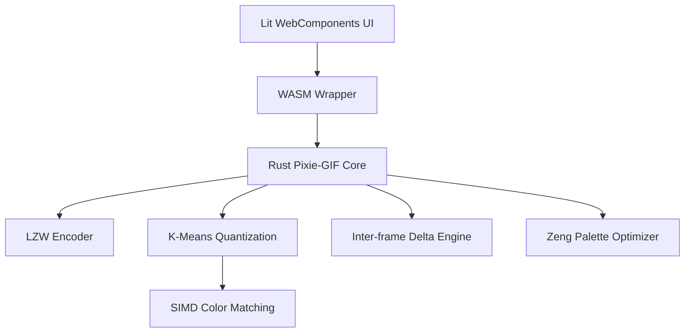

# Pixie-GIF Development Plan

This document outlines the phased implementation of a high-performance, zero-dependency GIF optimizer written in Rust (core) and Lit (UI).

## 1. Objectives
- **Zero-Dependency Core**: From-scratch implementation of LZW and GIF structure.
- **High Performance**: SIMD-accelerated color matching and optimized LZW.
- **Superior Compression**: "Lossy" GIF optimization using K-Means and inter-frame delta compression.
- **Modern UI**: A lightweight, framework-agnostic playground built with Lit WebComponents.

See [Algorithm Guide](algorithms.md) for technical deep-dives.

## 2. Architecture Overview

## 3. Implementation Phases

### Phase 1: Foundation & Benchmarking
- [x] Initialize Rust project structure (lib + modules).
- [x] Define Synthetic Asset Generation Workflow (Veo + FFmpeg) (`pixie-gif-3q7`).
- [x] Establish Temporary File & Test Fixture Management Policy (`pixie-gif-72z`).
- [x] Implement GIF benchmarking suite (baseline metrics) (`pixie-gif-sn4`).
- [ ] Implement foundational image utilities (color types, buffer management).

### Phase 2: Core GIF Engine
- [x] Implement **GIF89a** structure (Header, descriptors, blocks) (`pixie-gif-owd`).
- [x] Implement **LZW Encoder** from scratch (variable-length codes) (`pixie-gif-owd`).
- [x] Integrate Pixie-GIF Core into benchmarking suite (`pixie-gif-4hh`).
- [x] Basic static and animated GIF encoding.

### Phase 3: Advanced Optimization (The "Pixie" Sauce)
- [x] **Lossy Quantization**: K-Means++ and Perceptual CIELAB weighting (`pixie-gif-scu`, `pixie-gif-ypr`).
- [x] **Zeng Palette Reordering**: Optimized palette indices for maximum LZW compressibility (`pixie-gif-tdv`).
- [x] **Inter-frame Delta Compression**: Bounding-box and binary transparency optimization (`pixie-gif-n4q`).
- [x] **SIMD Acceleration**: Implement **Planar** kernels for nearest-color search (`pixie-gif-fps`).
- [x] **Error Diffusion Dithering**: Floyd-Steinberg for high visual fidelity (`pixie-gif-btb`).
- [x] **Lossy LZW**: Fuzzy Neighbor Matching for extreme compression.

### Phase 4: Lit WebComponents UI
- [x] Scaffold Lit project with Vite and TypeScript (`pixie-gif-ehz`).
- [x] Build core components (dropzone, comparison, stats).
- [x] Support direct MP4 frame extraction in the browser.
- [x] Connect Lit UI to WASM core.

### Phase 5: WASM & Integration
- [x] Create `wasm-bindgen` wrappers for the GIF core (`pixie-gif-0nf`).
- [x] Optimize WASM binary size via `talc` allocator (`pixie-gif-47s`).

### Phase 6: Automated Subjective Evaluation
- [x] Integrate `gemini-client-api` (Gemini 3 Flash) into benchmarking suite (`pixie-gif-plv`).
- [x] Implement "Synthetic MOS" scoring for visual quality.

### Future Exploration
- [ ] **Fuzzy Delta Compression**: Treat nearly-identical pixels as transparent to target the 15MB "gifski" zone.
- [ ] **WebP Support**: Research and prototype a minimal WebP encoder for comparative analysis (`pixie-gif-iaj`).

## 4. Key Implementation Notes
- **Memory**: Use buffer pooling and dictionary reuse to avoid allocations during animation processing.
- **SIMD**: Targeted at `wasm32-unknown-unknown` with fallback to scalar for non-supported browsers.
- **GIF Spec**: Global Color Table must follow Logical Screen Descriptor.
