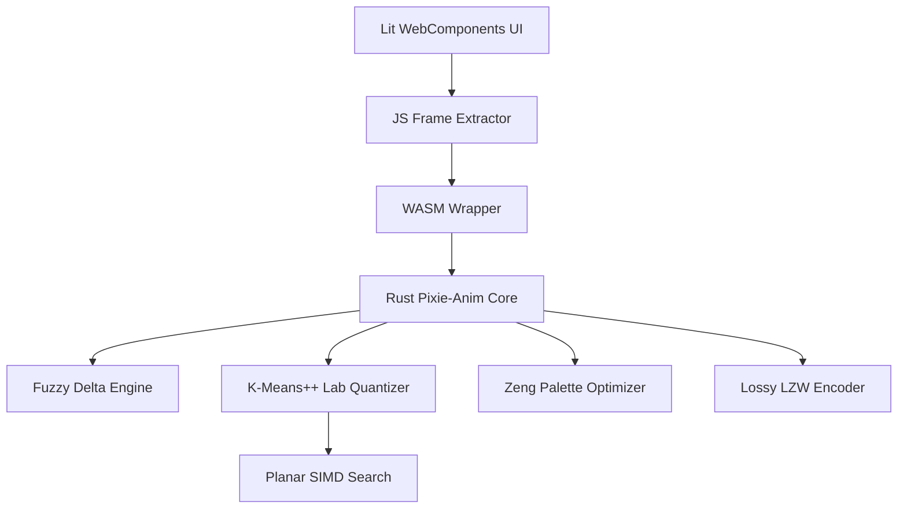

# Pixie-Anim Development Plan

This document outlines the phased implementation of a high-performance, zero-dependency short-form animation optimizer written in Rust (core) and Lit (UI).

## 1. Objectives
- **Zero-Dependency Core**: From-scratch implementation of Lempel-Ziv-Welch (LZW) and GIF89a structure.
- **High Performance**: SIMD-accelerated (Planar) color matching and optimized buffer management.
- **Superior Compression**: Lossy LZW and Perceptual Fuzzy Delta compression to beat industry standards.
- **Modern UI**: A local-first, WASM-powered playground built with Lit WebComponents.

See [Algorithm Guide](algorithms.md) for technical deep-dives.

## 2. Architecture Overview

## 3. Implementation Phases

### Phase 1: Foundation & Benchmarking
- [x] Initialize Rust project structure (lib + modules).
- [x] Define Synthetic Asset Generation Workflow (Veo + FFmpeg).
- [x] Establish Temporary File & Test Fixture Management Policy.
- [x] Implement GIF benchmarking suite (Gifsicle vs FFmpeg vs gifski).
- [x] Implement foundational image utilities (Rgb, Lab, Planar buffers).

### Phase 2: Core GIF Engine
- [x] Implement **GIF89a** structure (Header, descriptors, looping blocks).
- [x] Implement **LZW Encoder** from scratch (variable-length codes).
- [x] Integrate Pixie-Anim Core into benchmarking suite.
- [x] Basic static and animated GIF encoding.

### Phase 3: Advanced Optimization (The "Pixie Sauce")
- [x] **Lossy Quantization**: K-Means++ and Perceptual CIELAB weighting.
- [x] **Zeng Palette Reordering**: Optimized palette indices for maximum LZW compressibility.
- [x] **Inter-frame Delta Compression**: Bounding-box and Fuzzy Perceptual transparency.
- [x] **SIMD Acceleration**: Implement **Planar** kernels for nearest-color search.
- [x] **Error Diffusion Dithering**: Floyd-Steinberg for high visual fidelity.
- [x] **Lossy LZW**: Fuzzy Neighbor Matching for extreme compression.
- [x] **Temporally Stable Dithering**: Blue Noise / Ordered Dithering (`pixie-anim-2i3`).
- [x] **Temporal Denoising**: Cross-frame palette re-indexing logic (`pixie-anim-8wn`).
- [x] **Variable Dither Strength**: Control grain vs banding (`pixie-anim-xgr`).
- [ ] **Weighted CIELAB Palette Sampling**: Improve color accuracy (`pixie-anim-eib`) [P2].
- [ ] **3D Spatio-Temporal Dither Kernel**: Research & Prototype (`pixie-anim-h8q`) [P2].

### Phase 4: Lit WebComponents UI
- [x] Scaffold Lit project with Vite and TypeScript.
- [x] Build core components (dropzone, comparison, stats).
- [x] Support direct MP4 frame extraction in the browser.
- [x] Support direct WebM frame extraction in the browser.
- [x] Connect Lit UI to WASM core.
- [x] Update Web UI with dither selection (`pixie-anim-2xy`).
- [x] Implement Help/Explainer Dialog (`pixie-anim-8vp`).

### Phase 5: WASM, Integration & Quality Gates
- [x] Create `wasm-bindgen` wrappers for the animation core.
- [x] Optimize WASM binary size via `talc` allocator.
- [x] Fix WASM build features and stability (`pixie-anim-lsv`, `pixie-anim-3uz`).
- [x] Implement GitHub Actions for WASM build and deployment (`pixie-anim-gmu`).
- [x] Update AGENTS.md with Pre-publishing Checklist (`pixie-anim-9qh`).
- [x] Run Cargo Quality Gates (`pixie-anim-gc0`).
- [x] Verify all examples (`pixie-anim-lwc`).
- [ ] Implement chunked frame encoding to reduce memory pressure (`pixie-anim-zyw`) [P1].
- [ ] Implement frame-by-frame extraction and processing in UI (`pixie-anim-yw0`) [P1].
- [ ] Implement WASM-to-Native Parity Tests (`pixie-anim-337`).
- [ ] Add 'Black Area' histogram regression test.
- [ ] Implement Vitest suite for video-engine logic (`pixie-anim-1kb`).
- [ ] Add end-to-end integration test for WebM to GIF (`pixie-anim-9pj`).

### Phase 6: Automated Subjective Evaluation & Benchmarking
- [x] Integrate `gemini-client-api` (Gemini 3 Flash) into benchmarking suite.
- [x] Implement "Synthetic MOS" scoring for visual quality and artifacts.
- [x] Support Markdown reports in E2E suite (`pixie-anim-3vp`).
- [x] Implement Structured Reporting in `pixie-bench` (`pixie-anim-xt7`).
- [x] Integrate SSIM/PSNR objective metrics (`pixie-anim-r2y`).
- [x] Consolidate benchmarking scripts into unified CLI tool (`pixie-anim-p74`).
- [x] Implement fixture cleanup script (`pixie-anim-uwo`).
- [ ] **New Evaluation Suite**: High, med, low quality presets (`pixie-anim-no4`) [P2].
- [ ] **Analyze Gemini Judge Paradox**: AI evaluation consistency (`pixie-anim-750`) [P3].
- [ ] Implement A/B Comparative Jury in `judge.rs`.
- [ ] Create 'Gradient Stress' synthetic fixture.

### Phase 7: Rust Ecosystem & Crate Publication (Epic: `pixie-anim-xu0`)
- [x] Rename Pixo-GIF to Pixie-Anim across codebase (`pixie-anim-5b5`).
- [x] Add physical MIT LICENSE file (`pixie-anim-yng`).
- [x] Document examples in `examples/README.md` (`pixie-anim-59u`).
- [x] Implement `video_to_gif` example (`pixie-anim-0xr`).
- [x] Verify and fix `basic_optimization.rs` (`pixie-anim-j18`).
- [x] Refine Public API for crates.io (`pixie-anim-hjv`).
- [x] Implement Comprehensive Crate Documentation (`pixie-anim-5c8`).
- [x] Optimize Feature Gating for Zero-Dep Core (`pixie-anim-axj`).
- [x] Finalize Crate Metadata and Publish (`pixie-anim-bw2`).
- [x] Initial Publication to `crates.io` (`pixie-anim-1xy`).
- [ ] Automated CI/CD for Crate Quality.

### Future Exploration
- [ ] **Optimal LZW**: Look-ahead string matching logic.
- [ ] **WebP Support**: Prototype a zero-dependency WebP Lossless (VP8L) encoder.
- [ ] **MP4/WebM Benchmark Integration**: Native decoding in the CLI suite.

## 4. Key Implementation Notes
- **Memory**: Use dictionary reuse and Object URL revocation to avoid browser hangs on large animations.
- **SIMD**: Planar layout is required to beat scalar performance for 256-color palettes.
- **Codec**: Sequence-wide sampling is mandatory for temporal color consistency.
