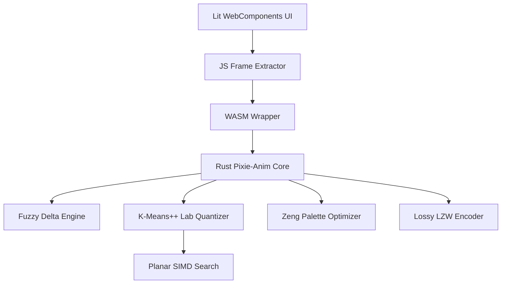

# Pixie-Anim Development Plan

This document outlines the phased implementation of a high-performance, zero-dependency short-form animation optimizer written in Rust (core) and Lit (UI).

## 1. Objectives
- **Zero-Dependency Core**: From-scratch implementation of Lempel-Ziv-Welch (LZW) and GIF89a structure.
- **High Performance**: SIMD-accelerated (Planar) color matching and optimized buffer management.
- **Superior Compression**: Lossy LZW and Perceptual Fuzzy Delta compression to beat industry standards.
- **Modern UI**: A local-first, WASM-powered playground built with Lit WebComponents.

See [Algorithm Guide](algorithms.md) for technical deep-dives.

## 2. Architecture Overview

## 3. Implementation Phases

### Phase 1: Foundation & Benchmarking
- [x] Initialize Rust project structure (lib + modules).
- [x] Define Synthetic Asset Generation Workflow (Veo + FFmpeg) (`pixie-gif-3q7`).
- [x] Establish Temporary File & Test Fixture Management Policy (`pixie-gif-72z`).
- [x] Implement GIF benchmarking suite (Gifsicle vs FFmpeg vs gifski) (`pixie-gif-sn4`).
- [x] Implement foundational image utilities (Rgb, Lab, Planar buffers).

### Phase 2: Core GIF Engine
- [x] Implement **GIF89a** structure (Header, descriptors, looping blocks) (`pixie-gif-owd`).
- [x] Implement **LZW Encoder** from scratch (variable-length codes) (`pixie-gif-owd`).
- [x] Integrate Pixie-Anim Core into benchmarking suite (`pixie-gif-4hh`).
- [x] Basic static and animated GIF encoding.

### Phase 3: Advanced Optimization (The "Pixie Sauce")
- [x] **Lossy Quantization**: K-Means++ and Perceptual CIELAB weighting (`pixie-gif-scu`, `pixie-gif-ypr`).
- [x] **Zeng Palette Reordering**: Optimized palette indices for maximum LZW compressibility (`pixie-gif-tdv`).
- [x] **Inter-frame Delta Compression**: Bounding-box and Fuzzy Perceptual transparency (`pixie-gif-n4q`).
- [x] **SIMD Acceleration**: Implement **Planar** kernels for nearest-color search (`pixie-gif-fps`).
- [x] **Error Diffusion Dithering**: Floyd-Steinberg for high visual fidelity (`pixie-gif-btb`).
- [x] **Lossy LZW**: Fuzzy Neighbor Matching for extreme compression.

### Phase 4: Lit WebComponents UI
- [x] Scaffold Lit project with Vite and TypeScript (`pixie-gif-ehz`).
- [x] Build core components (dropzone, comparison, stats).
- [x] Support direct MP4 frame extraction in the browser.
- [x] Support direct WebM frame extraction in the browser (`pixie-anim-83x`).
- [x] Connect Lit UI to WASM core.

### Phase 5: WASM & Integration
- [x] Create `wasm-bindgen` wrappers for the animation core (`pixie-gif-0nf`).
- [x] Optimize WASM binary size via `talc` allocator (`pixie-gif-47s`).
- [ ] Implement WASM-to-Native Parity Tests (`pixie-anim-d0s`).
- [ ] Add 'Black Area' histogram regression test (`pixie-anim-h1z`).
- [ ] Implement Vitest suite for video-engine logic (`pixie-anim-xbk`).
- [ ] Document CDP 'Sidecar' Testing Protocol for `website-assistant` (`pixie-anim-07n`).

### Phase 6: Automated Subjective Evaluation
- [x] Integrate `gemini-client-api` (Gemini 3 Flash) into benchmarking suite (`pixie-gif-plv`).
- [x] Implement "Synthetic MOS" scoring for visual quality and artifacts.
- [ ] Implement A/B Comparative Jury in `judge.rs` (`pixie-anim-9f5`).
- [ ] Create 'Gradient Stress' synthetic fixture (`pixie-anim-d35`).
- [ ] Implement confidence protocol (`pixie-anim-end`) [P1].
### Future Exploration
- [ ] **Advanced Fuzzy Delta**: Cross-frame palette re-indexing (`pixo-gif-c70`).
- [ ] **Optimal LZW**: Look-ahead string matching logic.
- [ ] **WebP Support**: Prototype a zero-dependency WebP Lossless (VP8L) encoder (`pixo-gif-iaj`).
- [ ] **MP4/WebM Benchmark Integration**: Native decoding in the CLI suite (`pixo-gif-o0g`).

## 4. Key Implementation Notes
- **Memory**: Use dictionary reuse and Object URL revocation to avoid browser hangs on large animations.
- **SIMD**: Planar layout is required to beat scalar performance for 256-color palettes.
- **Codec**: Sequence-wide sampling is mandatory for temporal color consistency.